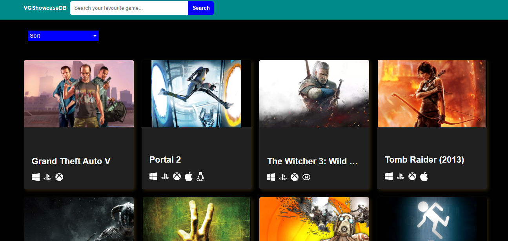

# VGShowcaseDB

Angular 11 project with rawg database made with this tutorial: https://www.youtube.com/watch?v=LiOzTQAz13Q

This is project for eduational purposes. It uses API from rapidapi.com which contains API from rawg.io. Only index page works for a current moment. Details page needs to be fixed.

Screenshot:

